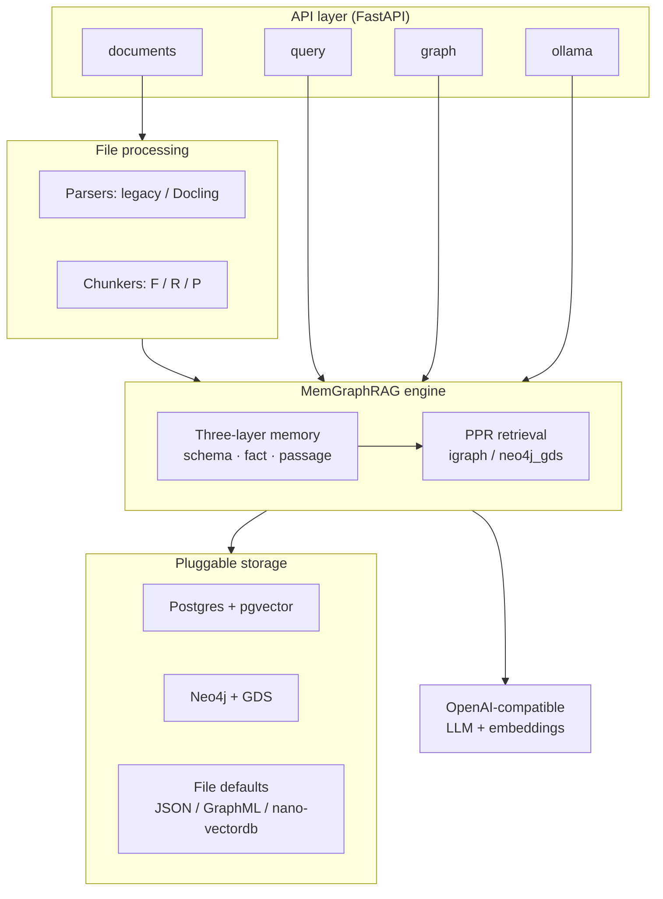

# MemGraphRAG

**EXEIO** project — authored and maintained by [ExeioS33](https://github.com/ExeioS33) / EXEIO.

Industrialized API server for [MemGraphRAG](https://arxiv.org/abs/2606.00610): a memory-enhanced GraphRAG engine with a three-layer memory (schema / fact / passage), conflict-aware construction, and Personalized PageRank retrieval.

This repository (`memgraphrag`; remote [`exeio-memgraphrag`](https://github.com/ExeioS33/exeio-memgraphrag)) packages the research engine as a LightRAG-style production service: FastAPI REST API, pluggable storage (PostgreSQL + pgvector, Neo4j + GDS), OpenAI-compatible LLM/embedding bindings, Docling-capable file processing, Docker Compose, and uv-based tooling.

## 🚀 Quick start

```bash
# Install (requires uv)
uv sync --extra api

# Copy and edit environment
cp env.example .env

# Run API server (file-based defaults; no external DB required)
uv run memgraphrag-server

# Or full stack (API image tagged exeio-memgraphrag:<version>)
docker compose up -d --build

# Optional: CLI + Streamlit clients (talk to the running API)
uv sync --extra client
uv run memgraphrag-cli health
uv run streamlit run memgraphrag/client/app.py
```

API docs: `http://localhost:9621/docs`  
Clients guide: [`docs/Clients.md`](docs/Clients.md).  
Compose image: `exeio-memgraphrag:0.1.0` (also `:latest`). Direct deps are exact-pinned in `pyproject.toml`; full tree is locked in `uv.lock`.

### 🎮 Streamlit playground

Optional emoji-heavy UI for query, ingest, param optimization, and graph exploration (talks to the running API — not baked into the service image):


## 🏗 Architecture overview



### 🧠 Three-layer memory

The core engine builds and queries a typed memory graph:

| Layer | Role |
|-------|------|
| **Schema** | Ontology / type structure for entities and relations |
| **Fact** | Conflict-aware factual triples extracted from content |
| **Passage** | Chunk-level evidence nodes linked into the graph |

Ingestion runs conflict detection and resolution before installing nodes and edges into the graph.

### 🔌 API layer

FastAPI app with routers aligned to LightRAG-style surfaces:

- **`documents`** — upload, status, and pipeline control
- **`query`** — MemGraphRAG-native retrieval and RAG QA
- **`graph`** — graph inspection and operations
- **`ollama`** — Ollama-compatible `/api` endpoints (prefixes such as `/naive`, `/context`, `/bypass`)

Auth supports JWT (`AUTH_ACCOUNTS`) and/or API key (`MEMGRAPHRAG_API_KEY`).

### 📄 File processing

- **Parsers**: `legacy` (local PDF/Office/text) and optional **Docling** (compose profile / external service)
- **Chunkers**: **F** (fixed), **R** (recursive), **P** (paragraph / semantic) — selected via env (`CHUNK_*`)

### 💾 Pluggable storage

Selected by `MEMGRAPHRAG_{KV,VECTOR,GRAPH,DOC_STATUS}_STORAGE`:

| Concern | Production backends | Defaults (no external DB) |
|---------|---------------------|---------------------------|
| KV / doc-status / vector | PostgreSQL + **pgvector** | JSON / nano-vectordb |
| Graph | **Neo4j** 5 + GDS | igraph GraphML files |

### 🔎 PPR retrieval

Personalized PageRank over the memory graph:

- **`PPR_ENGINE=igraph`** (default) — paper-exact local engine
- **`PPR_ENGINE=neo4j_gds`** — Neo4j Graph Data Science alternative

### 📡 Langfuse observability

Optional retrieval tracing via [Langfuse](https://langfuse.com/) (`LANGFUSE_ENABLE_TRACE`, keys, `LANGFUSE_BASE_URL` / `LANGFUSE_HOST`). When enabled, each `/query` emits nested spans for fact linking, PPR, dense fallback, and RAG generation. See [`docs/LangfuseObservability.md`](docs/LangfuseObservability.md).

### 🤖 LLM & embeddings

OpenAI-compatible bindings only (`LLM_*`, `EMBEDDING_*`) — point at OpenAI, Azure, vLLM, Ollama OpenAI shim, or any compatible gateway. No local torch/HF embedders in the service image for the POC path.

## 📦 Code Structure

High-level layout of this industrial server repo:

```text
memgraphrag/                 # repository root
├── memgraphrag/             # Python package
│   ├── api/                 # FastAPI app, auth, config, routers
│   ├── chunker/             # Chunkers F / R / P
│   ├── parser/              # Legacy + Docling parsers & registry
│   ├── storage/             # KV / vector / graph / doc-status backends
│   ├── ppr/                 # igraph & Neo4j GDS Personalized PageRank
│   ├── llm/                 # OpenAI-compatible LLM / embedding bindings
│   ├── observability/       # Langfuse retrieval tracing (optional)
│   ├── client/              # HTTP client, CLI (memgraphrag-cli), Streamlit UI
│   ├── openie/              # OpenIE fact extraction
│   ├── prompts/             # Prompt templates
│   ├── sidecar/             # Sidecar writer utilities
│   ├── utils/               # Hashing, tokenizer, env helpers
│   ├── core.py              # MemGraphRAG engine (index / retrieve / rag_qa)
│   ├── memory.py            # Three-layer memory (schema / fact / passage)
│   ├── pipeline.py          # Async ingestion pipeline
│   ├── retrieval.py         # Retrieval orchestration
│   ├── base.py              # Storage ABCs
│   └── rerank.py            # Fact / passage reranking
├── docs/                    # Deployment & API guides
├── tests/                   # Unit / edge / gated integration tests
├── scripts/                 # Helper scripts (e.g. test.sh)
├── Dockerfile               # Service image
├── docker-compose.yml       # Postgres + Neo4j + app (+ docling profile)
├── docker-entrypoint.sh     # Container entrypoint
├── pyproject.toml           # Packaging & extras
├── env.example              # Environment template
├── AGENTS.md                # Agent / contributor conventions
└── README.md
```

## 📚 Documentation

Guides under [`docs/`](docs/), including:

- [`docs/MemGraphRAG-API-Server.md`](docs/MemGraphRAG-API-Server.md) — API server
- [`docs/Clients.md`](docs/Clients.md) — CLI + Streamlit clients
- [`docs/DockerDeployment.md`](docs/DockerDeployment.md) — Compose stack
- [`docs/FileProcessingPipeline.md`](docs/FileProcessingPipeline.md) — parsers & chunkers
- [`docs/LangfuseObservability.md`](docs/LangfuseObservability.md) — Langfuse retrieval traces
- [`docs/ProgramingWithCore.md`](docs/ProgramingWithCore.md) — engine usage

## 🤖 Agent maintenance

This repository is maintained by AI agents. Conventions, tech stack, and architecture decisions live in [`AGENTS.md`](AGENTS.md).

## 📚 Citation

This industrial API server is based on / inspired by the MemGraphRAG research paper. Ownership of **this** repository remains with **EXEIO** / [ExeioS33](https://github.com/ExeioS33).

Paper: [arXiv:2606.00610](https://arxiv.org/abs/2606.00610)

```bibtex
@article{wu2026memgraphrag,
  title={MemGraphRAG: Memory-based Multi-Agent System for Graph Retrieval-Augmented Generation},
  author={Wu, Chuanjie and Xiang, Zhishang and Tang, Yunbo and Chen, Zerui and Zhang, Qinggang and Su, Jinsong},
  journal={arXiv preprint arXiv:2606.00610},
  year={2026}
}
```

## 📄 License

MIT — see [LICENSE](LICENSE). Copyright © 2026 EXEIO / ExeioS33.
