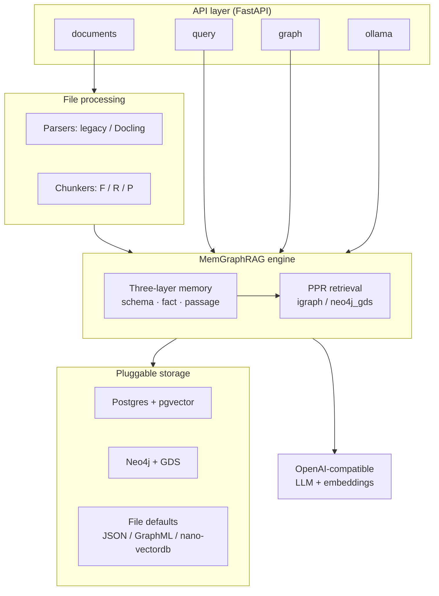

# MemGraphRAG

**EXEIO** project — authored and maintained by [ExeioS33](https://github.com/ExeioS33) / EXEIO.

Industrialized API server for [MemGraphRAG](https://arxiv.org/abs/2606.00610): a memory-enhanced GraphRAG engine with a three-layer memory (schema / fact / passage), conflict-aware construction, and Personalized PageRank retrieval.

This repository (`memgraphrag`; remote [`exeio-memgraphrag`](https://github.com/ExeioS33/exeio-memgraphrag)) packages the research engine as a LightRAG-style production service: FastAPI REST API, pluggable storage (PostgreSQL + pgvector, Neo4j + GDS), OpenAI-compatible LLM/embedding bindings, Docling-capable file processing, Docker Compose, and uv-based tooling.

## 💬 The web UI


A React chat interface **served by the API itself** — one process, one port, no CORS. Answers stream token by token with their source documents cited, threads persist in their own database, and the model can be switched per message across any OpenAI-compatible provider.

```bash
uv sync --extra api                   # Python side
docker compose up -d postgres-app     # chat persistence, host port 5433
cd web && npm install && npm run build && cd ..
cp env.example .env                   # then set LLM_BINDING_HOST / LLM_BINDING_API_KEY
uv run memgraphrag-server             # → http://localhost:9621/
```

The bundle is a build artifact and is **not committed**. Without it the server logs `Web UI not built; serving API only` and every API route keeps working, so the UI is strictly additive. `docker compose up` needs none of the above — the image builds the bundle in its own `node` stage.

Four screens, all backed by real endpoints — see [`docs/WebUI.md`](docs/WebUI.md) for the full mapping.

**Chat.** Ask in natural language; the engine retrieves through Personalized PageRank over the memory graph and answers with `[n]` citations resolving to the source documents. The three cards on the empty screen are **generated from your corpus** (most connected entities, most frequent fact schemas, dominant types), so they name things that are actually in your data. `Entrée` sends, `Maj+Entrée` inserts a newline.

**Provider + model picker** (top-left pill). Route a single message to Together AI, Ollama, vLLM, OpenAI, or the binding the server started with. The picker lists each provider's real catalogue, filtered to chat-capable models. **Embeddings are never switched** — the corpus is indexed with one model at one dimension, and the UI says so rather than offering a control that would quietly break retrieval.

**Bibliothèque.** Browse the folder set by `LIBRARY_ROOT`, recursively. Preview a PDF page by page, open or download the original, and jump to the graph passages extracted from it.

**Explorer le graphe.** A read-only Cypher console over the memory graph, with Graph / Table / Raw result views and a sidebar listing labels, relationship types and property keys. Write statements are refused; see [Cypher console](#-cypher-console) below.

## 🚀 Other ways to run it

```bash
# API only, file-backed defaults — no database, no Docker
uv sync --extra api && cp env.example .env
uv run memgraphrag-server                     # http://localhost:9621/docs

# Full stack: app + PostgreSQL/pgvector + Neo4j/GDS (+ app database)
docker compose up -d --build

# Optional CLI and Streamlit playground (talk to a running API)
uv sync --extra client
uv run memgraphrag-cli health
uv run streamlit run memgraphrag/client/app.py
```

Compose image: `exeio-memgraphrag:0.1.0` (also `:latest`). Direct deps are exact-pinned in `pyproject.toml`; the full tree is locked in `uv.lock`.

### Minimum configuration

`env.example` is the only template and documents every variable the code actually reads. To get a working server you need at least:

| Variable | What it does |
|---|---|
| `LLM_BINDING_HOST` / `LLM_BINDING_API_KEY` / `LLM_MODEL` | Where completions go. Any OpenAI-compatible gateway. |
| `EMBEDDING_BINDING_HOST` / `EMBEDDING_MODEL` / `EMBEDDING_DIM` | Where embeddings go. **Fix these before your first ingest and never change them** — they define the vector space the corpus lives in. |
| `MEMGRAPHRAG_{KV,VECTOR,GRAPH,DOC_STATUS}_STORAGE` | Backend selection. Defaults are file-backed and need no infrastructure. |
| `APP_DATABASE_URL` | Chat persistence. Unset ⇒ `/chat/*` answers 503 and the UI keeps threads in the browser tab. |
| `LIBRARY_ROOT` | Folder the library browses. Read-only. |

Auth is optional: with neither `AUTH_ACCOUNTS` nor `MEMGRAPHRAG_API_KEY` set the server is open, which is fine on a laptop and wrong anywhere else. Set `REQUIRE_AUTH=true` to fail closed.

## 📥 Ingesting documents

Four ways in, all landing in the same async pipeline (`pending → parsing → processing → processed`):

```bash
# One file
uv run memgraphrag-cli docs upload ./contract.pdf

# A whole tree
uv run memgraphrag-cli docs upload-dir ./corpus --recursive

# Raw text
uv run memgraphrag-cli docs text "MemGraphRAG builds a three-layer memory."

# Whatever is already sitting in INPUT_DIR
uv run memgraphrag-cli docs scan
```

Indexing is asynchronous — the upload returns as soon as the document is queued. Follow it with `uv run memgraphrag-cli docs list`, or watch the library panel, which polls while anything is in flight.

Extraction is checkpointed: each sub-batch is written to the OpenIE cache before the next starts, so a relaunch after a crash re-bills only what is missing. Ingesting the same bytes twice is a no-op.

> **Provenance.** Citations resolve through doc-status records (`file_path` + `chunk_ids`). A corpus ingested by a script calling `core.ainsert()` directly skips that table, and every citation then reads `unknown` while the library shows nothing — one missing table, not two bugs. `scripts/backfill_rfe_sources.py` repairs it **without re-ingesting**: chunk ids are content hashes, so re-running the same chunking reproduces them exactly. Run `--verify` first; it refuses to write below a 95 % overlap, because a misaligned backfill attaches the wrong filename to a passage, which is worse than no citation at all.

## 🔎 Querying

```bash
# Simple question
uv run memgraphrag-cli query "What are the obligations for an association?"

# Retrieval evidence only, no generation
uv run memgraphrag-cli query "..." --data-only

# Tune retrieval, or apply a named preset
uv run memgraphrag-cli query "..." --top-k 20 --linking-top-k 90 --no-skip-fact-rerank
uv run memgraphrag-cli query "..." --preset "⚖️ Balanced"
```

```bash
# Same thing over HTTP, routed to a specific provider
curl -X POST localhost:9621/query -H 'Content-Type: application/json' -d '{
  "query": "Quelles obligations pour une association ?",
  "mode": "ppr",
  "provider": "together",
  "model": "deepseek-ai/DeepSeek-V3",
  "top_k": 10
}'
```

**Four modes.** `ppr` (default) seeds Personalized PageRank from the facts matching your question and ranks passages by the resulting scores. `naive` skips the graph and does dense passage retrieval only — a useful baseline. `context` returns the retrieved evidence without generating an answer. `bypass` calls the LLM directly with no retrieval at all.

**Streaming.** `POST /query/stream` emits the references frame first, then one frame per token, then `[DONE]`. Retrieval is *not* streamed — Personalized PageRank has no partial result to emit — so the first token still costs a full retrieval, which the UI shows as a "Récupération en cours…" indicator.

**Multi-turn.** `conversation_history` reaches the LLM but is **not** used to rewrite the retrieval query: a follow-up like *"and the second one?"* retrieves against that literal text. Phrase follow-ups so they stand alone.

## 🕸 Cypher console

`POST /graph/cypher` runs read-only Cypher against the memory graph, and the UI wraps it in a Neo4j-Browser-style console.

```bash
curl -X POST localhost:9621/graph/cypher -H 'Content-Type: application/json' \
  -d '{"query": "MATCH p=()-[:ENTITY_TO_TYPE]->() RETURN p LIMIT 25"}'
```

Read-only is enforced in three layers, because no single one is sufficient: the backend must be `Neo4JStorage`; write keywords are rejected *after* string literals and comments are stripped (so `CONTAINS 'DELETE the invoice'` is not a false positive, and `n.created_at` is not mistaken for `CREATE`); and execution runs in a `default_access_mode="READ"` transaction, which Neo4j itself refuses to write from — the only layer a parser bypass cannot beat. A `LIMIT` is injected when the statement has none.

Every query is scoped to the workspace label. That matters if your Neo4j hosts more than one project: an unscoped query would render two unrelated knowledge graphs at once.

Three traps when writing your own Cypher against this schema: nodes have **no `id` property** (match on `entity_id`); `PASSAGE_ENTITY` runs **Entity → Passage** despite its name; and `ENTITY_RELATION` direction is not semantic — the pair is ordered by string sort at write time, so traverse it undirected.

## 🩺 Troubleshooting

| Symptom | Cause |
|---|---|
| Citations all read `unknown`, library empty | No doc-status records — see the provenance note above. |
| `/chat/*` returns 503 | `APP_DATABASE_URL` unset or the `postgres-app` container is down. |
| Server starts, every query 500s | An `SSL_CERT_FILE` pointing at a file that does not exist. |
| Model picker shows one entry | No `<PROVIDER>_API_KEY` set, so only the server's own binding is offered. |
| `WORKERS > 1` refused at startup | A file-backed backend is selected; its locks are in-process. Switch to PostgreSQL/Neo4j. |
| Answers ignore the corpus | Check `/health` — `retrieval_status` must be `ready`. |

### 🎮 Streamlit playground

Optional emoji-heavy UI for query, ingest, param optimization, and graph exploration (talks to the running API — not baked into the service image):


## 🏗 Architecture overview



### 🧠 Three-layer memory

The core engine builds and queries a typed memory graph:

| Layer | Role |
|-------|------|
| **Schema** | Ontology / type structure for entities and relations |
| **Fact** | Conflict-aware factual triples extracted from content |
| **Passage** | Chunk-level evidence nodes linked into the graph |

Ingestion runs conflict detection and resolution before installing nodes and edges into the graph.

What the engine guarantees while building that graph:

- **One entity per concept.** Every entity, relation and type is matched on a
  canonical key (NFKC, typographic folding, accents stripped, case folded —
  `memgraphrag/utils/canonical.py`); display text keeps its accents.
- **One language per corpus.** `MEMGRAPHRAG_LANGUAGE` pins the language of
  extracted labels and of answers, so a non-English corpus does not split every
  concept into two schemas.
- **A real fact graph.** Entities are joined by `ENTITY_RELATION` edges weighted
  by the number of facts that connect them, and typed by `ENTITY_TO_TYPE` edges —
  the substrate multi-hop PPR walks on.
- **An ontology filter that cannot empty the graph.** Facts whose schema falls
  under `ONTOLOGY_MIN_FREQUENCY` leave the vector store and the graph; if that
  would deactivate more than `ONTOLOGY_MAX_DEACTIVATION_RATIO` of them, the filter
  stands down for that build and says so.
- **Seeding that prefers dense passages.** Retrieval seeds carry the
  information-density term of the paper's Eq. 19 on top of similarity.

### 🛡 Ingestion resilience

Extraction is the billed part of ingestion, and the engine treats it as such:

- **Checkpoints.** OpenIE results are written every `OPENIE_CHECKPOINT_SIZE`
  chunks; a killed run keeps every completed sub-batch and a relaunch extracts
  only what is missing.
- **Retries before abort.** A chunk whose extraction fails is retried once at the
  end of the corpus; an ontology batch that comes back unparsable is asked again;
  only a repeated failure stops the run — with everything else already cached.
- **Repaired JSON.** Malformed model output (trailing commas, unescaped quotes,
  truncated tails) is repaired with `json-repair` instead of being counted as an
  empty extraction.
- **Bounded embedding requests.** Embedding calls are split by
  `EMBEDDING_BATCH_SIZE` / `EMBEDDING_BATCH_MAX_TOKENS` and halved on a provider
  refusal, so a corpus-sized insert never overflows a request ceiling.

Details and knobs: [`docs/IngestionResilience.md`](docs/IngestionResilience.md).

### 🔌 API layer

FastAPI app with routers aligned to LightRAG-style surfaces:

- **`documents`** — upload, status, and pipeline control
- **`query`** — MemGraphRAG-native retrieval and RAG QA
- **`graph`** — graph inspection and operations
- **`ollama`** — Ollama-compatible `/api` endpoints (prefixes such as `/naive`, `/context`, `/bypass`)

Auth supports JWT (`AUTH_ACCOUNTS`) and/or API key (`MEMGRAPHRAG_API_KEY`).
Enforced today: `/api/*` is never whitelisted (it fronts the billed LLM),
`CORS_ORIGINS=*` disables credentialed cross-origin requests, `REQUIRE_AUTH=true`
fails closed, `POST /login` is rate-limited per IP, and uploads are capped by
`MAX_UPLOAD_SIZE`. Details in
[`docs/MemGraphRAG-API-Server.md`](docs/MemGraphRAG-API-Server.md).

`POST /query/stream` is SSE-framed but **not** token streaming: the answer is
awaited in full, then emitted in one frame.

Run a single worker. Startup refuses `WORKERS > 1` while a file-backed backend is
selected, because two processes on one `WORKING_DIR` corrupt the JSON / GraphML
files.

### 📄 File processing

- **Parsers**: `legacy` (local PDF/Office/text) and optional **Docling** (compose profile / external service)
- **Chunkers**: **F** (fixed), **R** (recursive), **P** (paragraph / semantic) — selected per file type via `MEMGRAPHRAG_PARSER`; sized by `CHUNK_SIZE` / `CHUNK_OVERLAP_SIZE`, which apply to all three
- **LightRAG interop**: `scripts/import_lightrag_parsed.py` converts a LightRAG `__parsed__/` tree (Docling blocks, JSON tables, VLM-captioned drawings) into MemGraphRAG sidecars — tables become Markdown, captions are inlined and optionally translated — so a corpus parsed once is never parsed twice. See [`docs/MemGraphRAGSidecarFormat.md`](docs/MemGraphRAGSidecarFormat.md)

### 💾 Pluggable storage

Selected by `MEMGRAPHRAG_{KV,VECTOR,GRAPH,DOC_STATUS}_STORAGE`:

| Concern | Production backends | Defaults (no external DB) |
|---------|---------------------|---------------------------|
| KV / doc-status / vector | PostgreSQL + **pgvector** | JSON / nano-vectordb |
| Graph | **Neo4j** 5 + GDS | igraph GraphML files |

Two Neo4j behaviours worth knowing before pointing the engine at a shared server:

- **Workspace ownership.** The workspace name is the node label, and LightRAG
  uses the same convention. Every node MemGraphRAG writes carries an `mgr_owned`
  marker, `clear()` deletes only marked nodes, and startup refuses a workspace
  that already holds foreign nodes unless
  `MEMGRAPHRAG_ALLOW_SHARED_NEO4J_WORKSPACE=true`.
- **Batched writes.** Inside `graph.batch()` — which wraps every graph install —
  nodes and edges are buffered and flushed with `UNWIND` in 1 000-row statements
  grouped by label / relationship type, instead of two to three round trips per
  element.

The `MemGraphRAG` constructor defaults are literals; only the API server reads
`MEMGRAPHRAG_*_STORAGE`. Scripts that embed the engine should pass
`**resolve_storage_backends()` (see
[`docs/ProgramingWithCore.md`](docs/ProgramingWithCore.md)).

### 🔎 PPR retrieval

Personalized PageRank over the memory graph:

- **`PPR_ENGINE=igraph`** (default) — local in-process engine
- **`PPR_ENGINE=neo4j_gds`** — Neo4j Graph Data Science alternative

This is an adaptation of the paper's retrieval, not a faithful reimplementation:
the seeding and scoring rules are simplified, several equations of the paper have
no counterpart here, and nothing in the repository has been benchmarked against
the published results. Do not describe it as paper-exact — the harness that would
measure it ships in [`docs/Evaluation.md`](docs/Evaluation.md), and
[`docs/Reproduce.md`](docs/Reproduce.md) covers the A/B protocol around it.

### 📡 Langfuse observability

Optional retrieval tracing via [Langfuse](https://langfuse.com/) (`LANGFUSE_ENABLE_TRACE`, keys, `LANGFUSE_BASE_URL` / `LANGFUSE_HOST`). When enabled, each `/query` emits nested spans for fact linking, PPR, dense fallback, and RAG generation. See [`docs/LangfuseObservability.md`](docs/LangfuseObservability.md).

### 🤖 LLM & embeddings

OpenAI-compatible bindings only (`LLM_*`, `EMBEDDING_*`) — point at OpenAI, Azure, vLLM, Ollama OpenAI shim, or any compatible gateway. No local torch/HF embedders in the service image for the POC path.

`MAX_ASYNC_LLM` is the single concurrency bound for outbound LLM calls
(extraction, ontology, conflicts, answers). Embedding requests are batched and
bisected on refusal; see the ingestion resilience section above.

### ✅ CI

GitHub Actions runs lint (`ruff check` / `ruff format --check`), the offline test
suite on Python 3.12 and 3.13, and coverage on every push and pull request
(`.github/workflows/`). A TeamCity equivalent ships as a Kotlin DSL skeleton under
[`.teamcity/`](.teamcity/) with its setup commands in
[`docs/TeamCityCI.md`](docs/TeamCityCI.md).

## 📦 Code Structure

High-level layout of this industrial server repo:

```text
memgraphrag/                 # repository root
├── memgraphrag/             # Python package
│   ├── api/                 # FastAPI app, auth, config, routers
│   ├── chunker/             # Chunkers F / R / P
│   ├── parser/              # Legacy + Docling parsers & registry
│   ├── storage/             # KV / vector / graph / doc-status backends
│   ├── ppr/                 # igraph & Neo4j GDS Personalized PageRank
│   ├── chat/                # Chat threads & messages (own database, not RAG storage)
│   ├── llm/                 # OpenAI-compatible bindings + provider registry
│   ├── observability/       # Langfuse retrieval tracing (optional)
│   ├── client/              # HTTP client, CLI (memgraphrag-cli), Streamlit UI
│   ├── openie/              # OpenIE fact extraction
│   ├── prompts/             # Prompt templates
│   ├── sidecar/             # Sidecar writer utilities
│   ├── utils/               # Hashing, tokenizer, env helpers
│   ├── core.py              # MemGraphRAG engine (index / retrieve / rag_qa)
│   ├── memory.py            # Three-layer memory (schema / fact / passage)
│   ├── pipeline.py          # Async ingestion pipeline
│   ├── retrieval.py         # Retrieval-state scaffolding (not yet wired in)
│   ├── base.py              # Storage ABCs
│   └── rerank.py            # Fact / passage reranking
├── web/                     # React + Vite chat UI (built into memgraphrag/api/static)
├── docs/                    # Deployment & API guides
├── tests/                   # Unit / edge / gated integration tests
├── scripts/                 # test.sh, evaluate.py, bench.py, e2e_arxiv.py, import_lightrag_parsed.py
├── .github/workflows/       # GitHub Actions: lint, tests, coverage
├── .teamcity/               # TeamCity Kotlin DSL skeleton (see docs/TeamCityCI.md)
├── Dockerfile               # Service image
├── docker-compose.yml       # Postgres + Neo4j + app (+ docling profile)
├── docker-entrypoint.sh     # Container entrypoint
├── pyproject.toml           # Packaging & extras
├── env.example              # Environment template (the only one)
├── AGENTS.md                # Agent / contributor conventions
└── README.md
```

## 📚 Documentation

Guides under [`docs/`](docs/), including:

- [`docs/MemGraphRAG-API-Server.md`](docs/MemGraphRAG-API-Server.md) — API server
- [`docs/WebUI.md`](docs/WebUI.md) — web chat UI, provider routing, Cypher console
- [`docs/Clients.md`](docs/Clients.md) — CLI + Streamlit clients
- [`docs/DockerDeployment.md`](docs/DockerDeployment.md) — Compose stack
- [`docs/FileProcessingPipeline.md`](docs/FileProcessingPipeline.md) — parsers & chunkers
- [`docs/LangfuseObservability.md`](docs/LangfuseObservability.md) — Langfuse retrieval traces
- [`docs/ProgramingWithCore.md`](docs/ProgramingWithCore.md) — engine usage
- [`docs/IngestionResilience.md`](docs/IngestionResilience.md) — checkpoints, retries, JSON repair, embedding batching, language and canonical keys
- [`docs/MemGraphRAGSidecarFormat.md`](docs/MemGraphRAGSidecarFormat.md) — sidecar layout and the LightRAG importer
- [`docs/Logging.md`](docs/Logging.md) — structured stage / agent log lines
- [`docs/Evaluation.md`](docs/Evaluation.md) — evaluation metrics, judge prompt, golden set
- [`docs/Reproduce.md`](docs/Reproduce.md) — benchmark protocol and what is still unmeasured
- [`docs/TeamCityCI.md`](docs/TeamCityCI.md) — TeamCity project skeleton and setup commands

## 🤖 Agent maintenance

This repository is maintained by AI agents. Conventions, tech stack, and architecture decisions live in [`AGENTS.md`](AGENTS.md).

## 📚 Citation

This industrial API server is based on / inspired by the MemGraphRAG research paper. Ownership of **this** repository remains with **EXEIO** / [ExeioS33](https://github.com/ExeioS33).

Paper: [arXiv:2606.00610](https://arxiv.org/abs/2606.00610)

```bibtex
@article{wu2026memgraphrag,
  title={MemGraphRAG: Memory-based Multi-Agent System for Graph Retrieval-Augmented Generation},
  author={Wu, Chuanjie and Xiang, Zhishang and Tang, Yunbo and Chen, Zerui and Zhang, Qinggang and Su, Jinsong},
  journal={arXiv preprint arXiv:2606.00610},
  year={2026}
}
```

## 📄 License

MIT — see [LICENSE](LICENSE). Copyright © 2026 EXEIO / ExeioS33.

This project derives from two MIT-licensed upstreams — the [MemGraphRAG research
implementation](https://github.com/XMUDeepLIT/MemGraphRAG) (DeepLIT Group, Xiamen
University) and [LightRAG](https://github.com/HKUDS/LightRAG) (LightRAG Team). Their
required copyright notices are reproduced in [NOTICE](NOTICE), and the full license
texts in [THIRD_PARTY_LICENSES.md](THIRD_PARTY_LICENSES.md).
