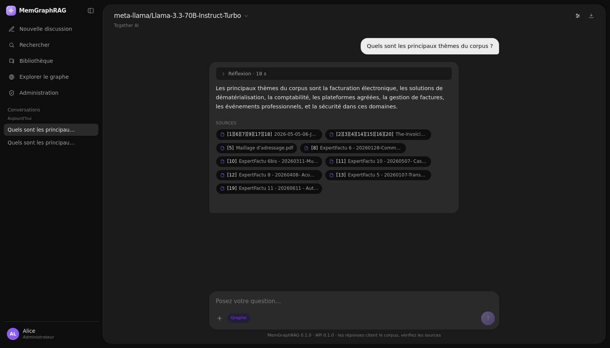
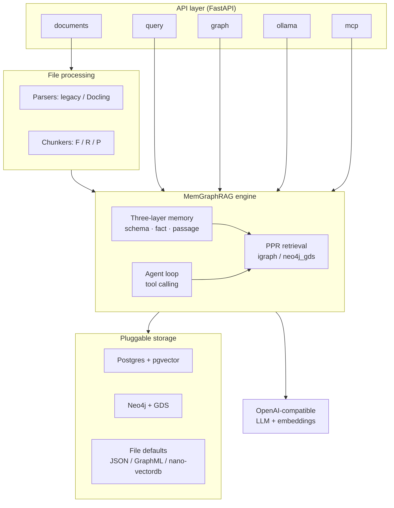

# MemGraphRAG

Industrialized API server for [MemGraphRAG](https://arxiv.org/abs/2606.00610): a memory-enhanced GraphRAG engine with a three-layer memory (schema / fact / passage), conflict-aware construction, and Personalized PageRank retrieval.

This repository packages the research engine as a LightRAG-style production service: FastAPI REST API, a React chat UI, pluggable storage (PostgreSQL + pgvector, Neo4j + GDS), OpenAI-compatible LLM/embedding bindings, an optional MCP server, Docker Compose and uv-based tooling. Ownership remains **EXEIO** / [ExeioS33](https://github.com/ExeioS33); remote [`exeio-memgraphrag`](https://github.com/ExeioS33/exeio-memgraphrag).

## 💬 The web UI



A React chat interface **served by the API itself** — one process, one port, no CORS. Answers stream token by token, each citation is a button that opens the exact passage in the library, and the model can be switched per message across any OpenAI-compatible provider.

```bash
uv sync --extra api                   # Python side
docker compose up -d postgres-app     # chat persistence, host port 5433
cd web && npm install && npm run build && cd ..
cp env.example .env                   # then set LLM_BINDING_HOST / LLM_BINDING_API_KEY
uv run memgraphrag-server             # → http://localhost:9621/
```

The bundle is a build artifact and is **not committed**. Without it the server logs `Web UI not built; serving API only` and every API route keeps working, so the UI is strictly additive. `docker compose up` needs none of the above — the image builds the bundle in its own `node` stage.

Four screens, all backed by real endpoints — full mapping in [`docs/WebUI.md`](docs/WebUI.md).

**Chat.** Ask in natural language; the engine retrieves through Personalized PageRank and answers with `[n]` citations. The three cards on the empty screen are **generated from your corpus** (most connected entities, most frequent fact schemas, dominant types), so they name things that are actually in your data. Clicking a source opens the document in the library, scrolled to the cited passage.

**Provider + model picker** (top-left pill). Route a single message to Together AI, Ollama, vLLM, OpenAI, or the binding the server started with. The picker lists each provider's real catalogue, filtered to chat-capable models. **Embeddings are never switched** — the corpus is indexed with one model at one dimension, and the UI says so rather than offering a control that would quietly break retrieval.

**Library** (*Bibliothèque*). Browse the folder set by `LIBRARY_ROOT`, recursively. Preview a PDF page by page, open or download the original, and read the graph passages extracted from it.

**Graph explorer** (*Explorer le graphe*). A read-only Cypher console with Graph / Table / Raw views. The canvas zooms on the wheel, pans on drag, and shows a card on node or edge hover; write statements are refused (see [Cypher console](#-cypher-console)).

## 🚀 Other ways to run it

```bash
# API only, file-backed defaults — no database, no Docker
uv sync --extra api && cp env.example .env
uv run memgraphrag-server                     # http://localhost:9621/docs

# Full stack: app + PostgreSQL/pgvector + Neo4j/GDS (+ app database)
docker compose up -d --build

# Optional CLI and Streamlit playground (talk to a running API)
uv sync --extra client
uv run memgraphrag-cli health
uv run streamlit run memgraphrag/client/app.py
```

Compose image: `exeio-memgraphrag:0.1.0` (also `:latest`). Direct deps are exact-pinned in `pyproject.toml`; the full tree is locked in `uv.lock`.

### Minimum configuration

`env.example` is the only template and documents every variable the code actually reads. To get a working server you need at least:

| Variable | What it does |
|---|---|
| `LLM_BINDING_HOST` / `LLM_BINDING_API_KEY` / `LLM_MODEL` | Where completions go. Any OpenAI-compatible gateway. |
| `EMBEDDING_BINDING_HOST` / `EMBEDDING_MODEL` / `EMBEDDING_DIM` | Where embeddings go. **Fix these before your first ingest and never change them** — they define the vector space the corpus lives in. |
| `MEMGRAPHRAG_{KV,VECTOR,GRAPH,DOC_STATUS}_STORAGE` | Backend selection. Defaults are file-backed and need no infrastructure. |
| `APP_DATABASE_URL` | Chat persistence. Unset ⇒ `/chat/*` answers 503 and the UI keeps threads in the browser tab. |
| `LIBRARY_ROOT` | Folder the library browses. Read-only. |

Auth is optional: with neither `AUTH_ACCOUNTS` nor `MEMGRAPHRAG_API_KEY` set the server is open, which is fine on a laptop and wrong anywhere else. Set `REQUIRE_AUTH=true` to fail closed.

Run a single worker. Startup refuses `WORKERS > 1` while a file-backed backend is selected, because two processes on one `WORKING_DIR` corrupt the JSON / GraphML files.

## 📥 Ingesting documents

Four ways in, all landing in the same async pipeline (`pending → parsing → processing → processed`):

```bash
# One file — an arXiv paper on AI agents, say
uv run memgraphrag-cli docs upload ./papers/ai-agents-survey.pdf

# A whole tree
uv run memgraphrag-cli docs upload-dir ./papers --recursive

# Raw text
uv run memgraphrag-cli docs text "MemGraphRAG builds a three-layer memory."

# Whatever is already sitting in INPUT_DIR
uv run memgraphrag-cli docs scan
```

Indexing is asynchronous — the upload returns as soon as the document is queued. Follow it with `uv run memgraphrag-cli docs list`, or watch the library panel, which polls while anything is in flight.

Extraction is checkpointed: each sub-batch is written to the OpenIE cache before the next starts, a failed chunk is retried once at the end of the corpus, and malformed model output is repaired with `json-repair` rather than counted as an empty extraction. A relaunch after a crash re-bills only what is missing, and ingesting the same bytes twice is a no-op. Details: [`docs/IngestionResilience.md`](docs/IngestionResilience.md).

> **Provenance.** Citations resolve through doc-status records (`file_path` + `chunk_ids`). A corpus ingested by a script that calls `core.ainsert()` directly skips that table, and every citation then reads `unknown` while the library shows nothing — one missing table, not two bugs. Use the pipeline (`docs upload`, `docs scan`, `POST /documents/*`) and this cannot happen.

## 🔎 Querying

```bash
# Simple question against the ingested paper
uv run memgraphrag-cli query "Which benchmarks were used to evaluate the agents?"

# Retrieval evidence only, no generation
uv run memgraphrag-cli query "..." --data-only

# Tune retrieval, or apply a named preset
uv run memgraphrag-cli query "..." --top-k 20 --linking-top-k 90 --no-skip-fact-rerank
uv run memgraphrag-cli query "..." --preset "⚖️ Balanced"
```

```bash
# Same thing over HTTP, routed to a specific provider
curl -X POST localhost:9621/query -H 'Content-Type: application/json' -d '{
  "query": "How do the surveyed agent architectures handle tool use?",
  "mode": "ppr",
  "provider": "together",
  "model": "deepseek-ai/DeepSeek-V3",
  "top_k": 10
}'
```

**Five modes.** `ppr` (default) seeds Personalized PageRank from the facts matching your question and ranks passages by the resulting scores. `naive` skips the graph and does dense passage retrieval only — a useful baseline. `context` returns the retrieved evidence without generating an answer. `bypass` calls the LLM directly with no retrieval. `agent` hands the model a `retrieve` tool and lets it decide what to search for and how often.

**Agent mode costs more, and buys follow-ups.** In every other mode the retrieval query is the user's literal text, so a follow-up like *"and the second one?"* searches the corpus for that phrase. The loop reads the conversation and writes its own search string instead. The price is at least one extra LLM round trip per answer, often two, and the model must support tool calling — one that does not is **refused with a message**, never degraded into an ungrounded answer. `AGENT_CONTEXT_BUDGET` bounds the message list; older tool results are evicted before a third hop can overflow the window. `AGENT_DECIDE_MAX_TOKENS` bounds what a *deciding* turn may generate — its prose is discarded, and uncapped it dominated the turn's latency.

```bash
curl -X POST localhost:9621/query/stream -H 'Content-Type: application/json' -d '{
  "query": "and how does that compare to the second framework?",
  "mode": "agent",
  "conversation_history": [
    {"role": "user", "content": "Which agent frameworks does the paper compare?"},
    {"role": "assistant", "content": "It compares three: ..."}
  ]
}'
```

**Streaming.** `POST /query/stream` emits the references frame first, then one frame per token, then `[DONE]`. Retrieval is *not* streamed — Personalized PageRank has no partial result to emit — so the first token still costs a full retrieval, which the UI shows as a "Récupération en cours…" indicator. Agent mode adds `tool_call` frames as the loop works; clients that predate them ignore the shape.

**Citations point at passages.** `references[]` carries one entry per retrieved passage, numbered exactly as the prompt fenced them, so `[3]` in an answer is `reference_id` 3. Each entry carries the chunk id and, when doc-status knew one, the full path. `content` is always `null` — passage text comes from `POST /query/data` or `GET /documents/{id}/chunks`.

## 🔌 MCP server

An optional read-only MCP surface, mounted on the API's own port at `/mcp`, so a third-party client (Claude Desktop, an IDE, another agent) can query the same corpus.

```bash
MCP_ENABLED=true MCP_ALLOWED_HOSTS=rag.example.com,rag.example.com:9621 uv run memgraphrag-server
```

Tools: `retrieve`, `search_documents`, `read_document`, `cypher`. Nothing writes — a third-party client cannot ingest into or modify the graph. Authentication reuses the API's own credentials, so there is one place to revoke one. `MCP_ALLOWED_HOSTS` is not optional off localhost: the transport's DNS-rebinding protection answers **421 Invalid Host header** for anything unlisted, and the entries are exact matches. Setup and troubleshooting: [`docs/MCP.md`](docs/MCP.md).

## 🕸 Cypher console

`POST /graph/cypher` runs read-only Cypher against the memory graph, and the UI wraps it in a Neo4j-Browser-style console.

```bash
curl -X POST localhost:9621/graph/cypher -H 'Content-Type: application/json' \
  -d '{"query": "MATCH p=()-[:ENTITY_TO_TYPE]->() RETURN p LIMIT 25"}'
```

Read-only is enforced in three layers because no single one is sufficient — backend check, keyword rejection *after* literals and comments are stripped, and a `default_access_mode="READ"` transaction that Neo4j itself refuses to write from. A `LIMIT` is injected when the statement has none, and every query is scoped to the workspace label, which matters if your Neo4j hosts more than one project. The layers are described in [`docs/WebUI.md`](docs/WebUI.md).

Three traps when writing your own Cypher against this schema: nodes have **no `id` property** (match on `entity_id`); `PASSAGE_ENTITY` runs **Entity → Passage** despite its name; and `ENTITY_RELATION` direction is not semantic — the pair is ordered by string sort at write time, so traverse it undirected.

## 🩺 Troubleshooting

| Symptom | Cause |
|---|---|
| Citations all read `unknown`, library empty | No doc-status records — see the provenance note above. |
| `/chat/*` returns 503 | `APP_DATABASE_URL` unset or the `postgres-app` container is down. |
| Server starts, every query 500s | An `SSL_CERT_FILE` pointing at a file that does not exist. |
| Model picker shows one entry | No `<PROVIDER>_API_KEY` set, so only the server's own binding is offered. |
| `mode=agent` returns 400 | The selected model cannot call tools. Pick another, or query with `mode=ppr`. |
| MCP client gets 421 | The request's `Host` is not in `MCP_ALLOWED_HOSTS`. List it with and without the port. |
| `WORKERS > 1` refused at startup | A file-backed backend is selected; its locks are in-process. |
| Answers ignore the corpus | Check `/health` — `retrieval_status` must be `ready`. |

### 🎮 Streamlit playground

Optional emoji-heavy UI for query, ingest, param optimization, and graph exploration (talks to the running API — not baked into the service image):


## 🏗 Architecture overview



### 🧠 Three-layer memory

| Layer | Role |
|-------|------|
| **Schema** | Ontology / type structure for entities and relations |
| **Fact** | Conflict-aware factual triples extracted from content |
| **Passage** | Chunk-level evidence nodes linked into the graph |

Ingestion runs conflict detection and resolution before installing nodes and edges. Four guarantees hold while that graph is built: **one entity per concept** (everything is matched on a canonical key — NFKC, typographic folding, accents stripped, case folded); **one language per corpus** (`MEMGRAPHRAG_LANGUAGE` pins extracted labels and answers, so a non-English corpus does not split every concept in two); **a real fact graph** (`ENTITY_RELATION` edges weighted by the number of facts joining two entities, typed by `ENTITY_TO_TYPE` — the substrate multi-hop PPR walks on); and **an ontology filter that cannot empty the graph** (it stands down, and says so, if it would deactivate more than `ONTOLOGY_MAX_DEACTIVATION_RATIO` of the facts).

### 💾 Storage, retrieval, bindings

Storage is selected by `MEMGRAPHRAG_{KV,VECTOR,GRAPH,DOC_STATUS}_STORAGE`:

| Concern | Production backends | Defaults (no external DB) |
|---------|---------------------|---------------------------|
| KV / doc-status / vector | PostgreSQL + **pgvector** | JSON / nano-vectordb |
| Graph | **Neo4j** 5 + GDS | igraph GraphML files |

Two Neo4j behaviours matter before pointing the engine at a shared server. **Workspace ownership**: the workspace name is the node label and LightRAG uses the same convention, so every node MemGraphRAG writes carries an `mgr_owned` marker, `clear()` deletes only marked nodes, and startup refuses a workspace holding foreign nodes unless `MEMGRAPHRAG_ALLOW_SHARED_NEO4J_WORKSPACE=true`. **Batched writes**: inside `graph.batch()`, which wraps every graph install, nodes and edges are flushed with `UNWIND` in 1 000-row statements grouped by label.

**Retrieval** is Personalized PageRank over that graph — `PPR_ENGINE=igraph` (default, in-process) or `neo4j_gds`. This is an adaptation of the paper's retrieval, not a faithful reimplementation: the seeding and scoring rules are simplified, several equations have no counterpart here, and nothing in the repository has been benchmarked against the published results. Do not describe it as paper-exact — the harness that would measure it ships in [`docs/Evaluation.md`](docs/Evaluation.md).

**Bindings** are OpenAI-compatible only (`LLM_*`, `EMBEDDING_*`) — OpenAI, Azure, vLLM, an Ollama shim, or any compatible gateway. `MAX_ASYNC_LLM` is the single concurrency bound for outbound calls; embedding requests are batched by `EMBEDDING_BATCH_SIZE` and halved on a provider refusal.

**File processing** uses a parser registry (`legacy`, optional `docling`) and three chunkers (fixed / recursive / paragraph), selected per file type by `MEMGRAPHRAG_PARSER`. `scripts/import_lightrag_parsed.py` converts a LightRAG `__parsed__/` tree into MemGraphRAG sidecars so a corpus parsed once is never parsed twice.

**Observability** is optional Langfuse tracing (`LANGFUSE_ENABLE_TRACE` plus keys). Both the buffered and the streamed query paths open a `memgraphrag.query` root span with nested fact-linking, PPR, dense-fallback and generation observations; agent mode adds a `memgraphrag.agent` tree of `think` / `act` steps with the GraphRAG spans nested under each tool call. See [`docs/LangfuseObservability.md`](docs/LangfuseObservability.md).

**CI** runs lint (`ruff check` / `ruff format --check`), the offline suite on Python 3.12 and 3.13, and coverage on every push and pull request (`.github/workflows/`). A TeamCity equivalent ships as a Kotlin DSL skeleton under [`.teamcity/`](.teamcity/).

## 📦 Code structure

```text
memgraphrag/
├── memgraphrag/             # Python package
│   ├── agent/               # Tool-calling loop, tool schemas, context budget
│   ├── api/                 # FastAPI app, auth, config, routers
│   ├── mcp/                 # MCP server + token verifier
│   ├── chunker/ parser/ sidecar/   # File processing
│   ├── storage/ ppr/ openie/ llm/  # Backends, PPR engines, extraction, bindings
│   ├── chat/ client/ observability/ evaluation/
│   ├── core.py              # Engine: index / retrieve / rag_qa / agent
│   ├── memory.py            # Three-layer memory
│   ├── pipeline.py          # Async ingestion pipeline
│   └── base.py              # Storage ABCs + QueryParam
├── web/                     # React + Vite chat UI (built into memgraphrag/api/static)
├── docs/ tests/ scripts/    # Guides, unit + gated integration tests, tooling
├── .github/workflows/ .teamcity/
├── Dockerfile docker-compose.yml docker-entrypoint.sh
├── pyproject.toml env.example AGENTS.md
└── README.md
```

Module conventions, naming rules and architecture decisions live in [`AGENTS.md`](AGENTS.md).

## 📚 Documentation

- [`docs/MemGraphRAG-API-Server.md`](docs/MemGraphRAG-API-Server.md) — API server
- [`docs/WebUI.md`](docs/WebUI.md) — web chat UI, provider routing, Cypher console
- [`docs/MCP.md`](docs/MCP.md) — MCP server: clients, allowed hosts, exposed tools
- [`docs/Clients.md`](docs/Clients.md) — CLI + Streamlit clients
- [`docs/DockerDeployment.md`](docs/DockerDeployment.md) — Compose stack
- [`docs/FileProcessingPipeline.md`](docs/FileProcessingPipeline.md) — parsers & chunkers
- [`docs/LangfuseObservability.md`](docs/LangfuseObservability.md) — traces
- [`docs/ProgramingWithCore.md`](docs/ProgramingWithCore.md) — engine usage
- [`docs/IngestionResilience.md`](docs/IngestionResilience.md) — checkpoints, retries, JSON repair, batching
- [`docs/MemGraphRAGSidecarFormat.md`](docs/MemGraphRAGSidecarFormat.md) — sidecars and the LightRAG importer
- [`docs/Logging.md`](docs/Logging.md) — structured stage / agent log lines
- [`docs/Evaluation.md`](docs/Evaluation.md) — metrics, judge prompt, golden set
- [`docs/Reproduce.md`](docs/Reproduce.md) — benchmark protocol and what is still unmeasured
- [`docs/TeamCityCI.md`](docs/TeamCityCI.md) — TeamCity skeleton

This repository is maintained by AI agents; conventions live in [`AGENTS.md`](AGENTS.md).

## 📚 Citation

Paper: [arXiv:2606.00610](https://arxiv.org/abs/2606.00610)

```bibtex
@article{wu2026memgraphrag,
  title={MemGraphRAG: Memory-based Multi-Agent System for Graph Retrieval-Augmented Generation},
  author={Wu, Chuanjie and Xiang, Zhishang and Tang, Yunbo and Chen, Zerui and Zhang, Qinggang and Su, Jinsong},
  journal={arXiv preprint arXiv:2606.00610},
  year={2026}
}
```

## 📄 License

MIT — see [LICENSE](LICENSE). Copyright © 2026 EXEIO / ExeioS33.

This project derives from two MIT-licensed upstreams — the [MemGraphRAG research
implementation](https://github.com/XMUDeepLIT/MemGraphRAG) (DeepLIT Group, Xiamen
University) and [LightRAG](https://github.com/HKUDS/LightRAG) (LightRAG Team). Their
required copyright notices are reproduced in [NOTICE](NOTICE), and the full license
texts in [THIRD_PARTY_LICENSES.md](THIRD_PARTY_LICENSES.md).
