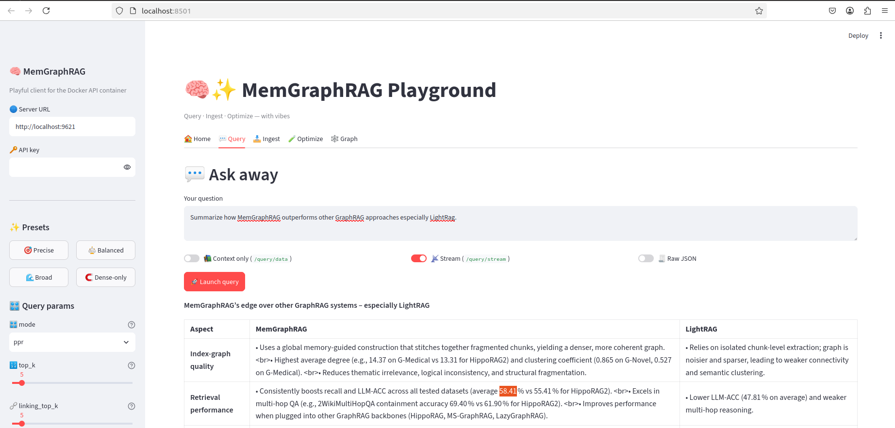

# MemGraphRAG clients (CLI + Streamlit)

Lightweight clients for the Docker / local API container. They share one HTTP layer (`memgraphrag.client.http.MemGraphRAGClient`) and a single parameter registry (`memgraphrag.client.params`).

## Install

```bash
uv sync --extra client
# or with the full test matrix:
uv sync --extra test
```

Pinned packages: `streamlit==1.60.0`, `typer==0.27.1`, `rich==15.0.0`.

## Auth & connection

| Variable | Role |
|----------|------|
| `MEMGRAPHRAG_SERVER_URL` | Base URL (default `http://localhost:9621`) |
| `MEMGRAPHRAG_API_KEY` | Sent as `X-API-Key` |

CLI flags `--server` / `--api-key` override the env vars. The Streamlit sidebar has the same fields.

## Coverage matrix

| HTTP | CLI | Streamlit tab |
|------|-----|---------------|
| `GET /health` | `memgraphrag-cli health` | 🏠 Home |
| `POST /query` | `memgraphrag-cli query` | 💬 Query |
| `POST /query/data` | `query --data-only` | 💬 Query (context) |
| `POST /query/stream` | `query --stream` | 💬 Query (stream) |
| `POST /documents/upload` | `docs upload` / `upload-dir` / `upload-url` | 📥 Ingest |
| `POST /documents/text` | `docs text` | 📥 Ingest |
| `GET /documents/` | `docs list` | 📥 Ingest |
| `POST /documents/scan` | `docs scan` | 📥 Ingest |
| `DELETE /documents/` | `docs clear` (POC stub) | — |
| `GET /graphs` | `graph show` | 🕸️ Graph |
| `GET /graph/label/list` | `graph labels` | 🕸️ Graph |
| (client-side) | `optimize` | 🧪 Optimize |

Also: `memgraphrag-cli params` prints the tunable knobs, presets, and this coverage table.

## CLI usage

```bash
export MEMGRAPHRAG_SERVER_URL=http://localhost:9621
export MEMGRAPHRAG_API_KEY=your-key   # if the server requires it

uv run memgraphrag-cli health
uv run memgraphrag-cli params

uv run memgraphrag-cli query "What is MemGraphRAG?" --preset "⚖️ Balanced"
uv run memgraphrag-cli query "…" --data-only --top-k 10
uv run memgraphrag-cli query "…" --stream

uv run memgraphrag-cli docs upload ./paper.pdf
uv run memgraphrag-cli docs upload-dir ./corpus --recursive
uv run memgraphrag-cli docs upload-url https://arxiv.org/pdf/2606.00610
uv run memgraphrag-cli docs text "Inline note to index"
uv run memgraphrag-cli docs list
uv run memgraphrag-cli docs scan

uv run memgraphrag-cli graph labels
uv run memgraphrag-cli graph show --label Passage --limit 50

uv run memgraphrag-cli optimize "What is the three-layer memory?" \
  --top-n 3 --output /tmp/opt.json
```

Tunable query flags include `--mode`, `--top-k`, `--linking-top-k`, `--passage-node-weight`, `--damping`, `--fact-similarity-threshold`, `--skip-fact-rerank`, `--user-prompt`, and `--preset`.

## Streamlit UI

```bash
uv run --extra client streamlit run memgraphrag/client/app.py
```

Opens at `http://localhost:8501` by default. Sidebar: server URL, API key, presets, and query-param knobs. Main area: tabbed Home / Query / Ingest / Optimize / Graph.



Tabs:

1. **Home** — connect / health (core + API versions, pipeline busy).
2. **Query** — full answer, context-only, or SSE stream; sidebar presets + sliders.
3. **Ingest** — file upload, local directory, URL, inline text, server inbox scan; document status with manual refresh.
4. **Optimize** — hybrid param lab (see below); apply winners back to the Query tab.
5. **Graph** — label filter + node/edge explorer.

## Hybrid optimizer

`memgraphrag.client.optimize.run_optimize` (CLI `optimize` / UI Param lab):

1. **Phase 1** — Cartesian sweep over the discrete grid; each combo scored via `/query/data` retrieval metrics (mean/max doc scores + soft coverage).
2. **Phase 2** — Top-N winners get a full `/query` answer, then an LLM judge call with `mode=bypass` and `only_need_context=False` (server default). Final score blends retrieval (40%) and judge/10 (60%).

Default grid axes: `mode`, `top_k`, `linking_top_k`, `passage_node_weight`, `damping`, `fact_similarity_threshold`, `skip_fact_rerank` (see `params.QUERY_PARAMS`). Use `--no-judge` / UI toggle for retrieval-only ranking.

## Library usage

```python
from memgraphrag.client import MemGraphRAGClient

with MemGraphRAGClient() as client:
    print(client.health())
    print(client.query("What is PPR retrieval?", mode="ppr", top_k=5))
```

Pass `transport=` (e.g. `httpx.MockTransport`) for offline tests.
